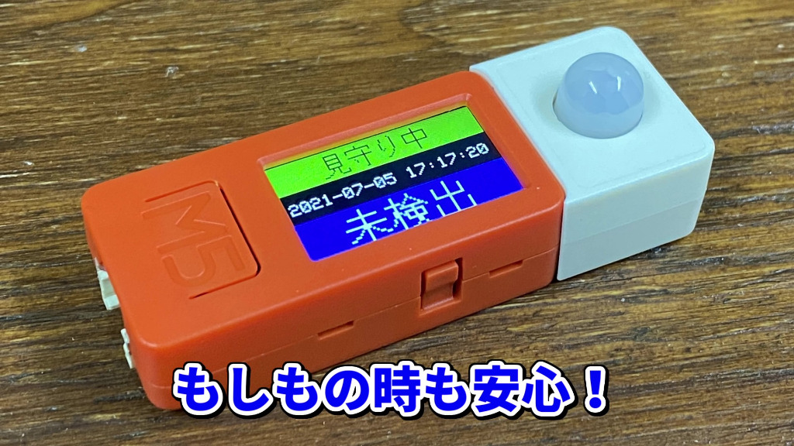
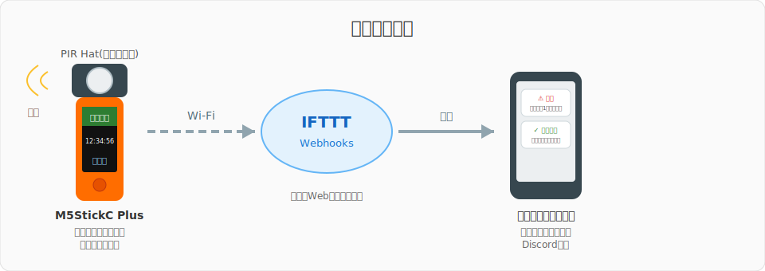
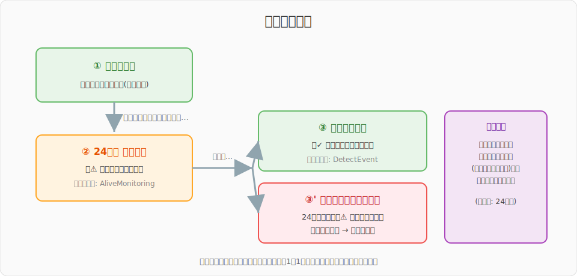
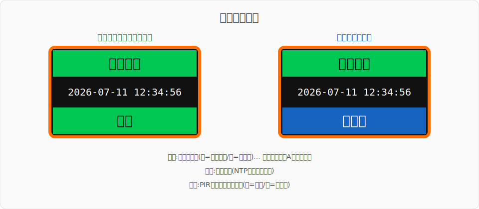

# PIR_AliveMonitoring — 独り暮らし向け「死活監視システム」

[](LICENSE)
[](https://docs.m5stack.com/en/core/m5stickc_plus)
[](https://www.arduino.cc/en/software)
[](https://protopedia.net/prototype/2432)

**M5StickC Plus + 人感センサ(PIR)で作る、独り暮らしのための見守りデバイスです。**

トイレなど「生活していれば必ず使う場所」にセンサを置き、**一定時間(初期設定では24時間)動きが検出されなかったらスマホへ通知**を送ります。コロナ禍の自粛生活で「孤独死」が頭をよぎった作者が、自分自身を見守るために作りました。



[](https://www.youtube.com/watch?v=CHICFVoL_tc)

> 📖 プロジェクトの詳細・開発ストーリーは [ProtoPedia の作品ページ](https://protopedia.net/prototype/2432) をご覧ください。

---

## 目次

- [仕組み](#仕組み)
- [必要なもの](#必要なもの)
- [セットアップ手順](#セットアップ手順)
  - [1. Arduino IDE の準備](#1-arduino-ide-の準備)
  - [2. ライブラリのインストール](#2-ライブラリのインストール)
  - [3. IFTTT の設定](#3-ifttt-の設定)
  - [4. config.h の作成](#4-configh-の作成)
  - [5. M5StickC Plus への書き込み](#5-m5stickc-plus-への書き込み)
- [使い方](#使い方)
- [カスタマイズ](#カスタマイズ)
- [トラブルシューティング](#トラブルシューティング)
- [ライセンス](#ライセンス)

---

## 仕組み

M5StickC Plus に取り付けた PIR センサ(人感センサ)が動きを監視し、Wi-Fi 経由で [IFTTT](https://ifttt.com/)(無料の Web サービス連携ツール)にイベントを送信、IFTTT がスマホへ通知を届けます。



通知は2種類あります。



| 通知 | タイミング | 意味 |
|---|---|---|
| ⚠ **未検出通知** | 24時間(設定値)動きが無かったとき | 「もしかして倒れている…?」の警告。以降24時間ごとに繰り返し通知 |
| ✓ **生存確認通知** | 未検出通知のあと、再び動きを検出したとき | 「無事でした!」の安心通知 |

> [!TIP]
> 通知先を家族や友人のスマホ(メールや Discord の共有チャンネルなど)にしておくと、万一のときに気づいてもらえます。

## 必要なもの

| 品名 | 説明 | 参考 |
|---|---|---|
| [M5StickC Plus](https://docs.m5stack.com/en/core/m5stickc_plus) | ESP32搭載の小型マイコン(画面・Wi-Fi内蔵) | M5Stack公式 / スイッチサイエンス等で購入可 |
| [PIR Hat (U054)](https://docs.m5stack.com/en/hat/hat-pir) | M5StickC用の人感センサHat。本体上部に挿すだけ | 同上 |
| USB Type-C ケーブル | プログラム書き込みと給電用 | データ通信対応のもの |
| 2.4GHz帯の Wi-Fi 環境 | 通知送信用 | ※ESP32は5GHz帯に接続できません |
| スマホ + [IFTTT](https://ifttt.com/) アカウント | 通知の受信用 | 無料プランでOK |

> [!NOTE]
> **配線・ハンダ付けは不要です。** PIR Hat を M5StickC Plus 上部の HAT 用ソケット(8ピン)に挿し込むだけで完成します。
>
> 後継機の **M5StickC Plus2** では使用ライブラリが異なるため、そのままでは動作しません(要改修)。

## セットアップ手順

### 1. Arduino IDE の準備

1. [Arduino IDE](https://www.arduino.cc/en/software)(2.x推奨)をインストールします。
2. `ファイル` → `基本設定` を開き、「追加のボードマネージャのURL」に以下を追加します。

   ```
   https://static-cdn.m5stack.com/resource/arduino/package_m5stack_index.json
   ```

3. `ツール` → `ボード` → `ボードマネージャ` で **「M5Stack」** を検索してインストールします。
4. `ツール` → `ボード` → `M5Stack` から **「M5StickCPlus」** を選択します。

### 2. ライブラリのインストール

`ツール` → `ライブラリを管理` から以下の2つを検索してインストールします。

| ライブラリ名 | 作者 | 用途 |
|---|---|---|
| **M5StickCPlus** | M5Stack | 本体制御 |
| **efont Unicode Font Data** | tanakamasayuki | 画面への日本語表示 |

### 3. IFTTT の設定

通知の送り先を IFTTT で設定します。**アプレット(自動化レシピ)を2つ**作成します。無料プランで作成できる数はアプレット2個までなので、ちょうど収まります。

> [!IMPORTANT]
> かつて定番だった **LINE Notify は2025年3月でサービス終了**しました。通知先には IFTTT公式アプリのプッシュ通知(Notifications)、メール(Email)、Discord などを利用してください。

#### 3-1. アカウント作成と Webhooks キーの取得

1. [IFTTT](https://ifttt.com/) でアカウントを作成します(スマホに [IFTTTアプリ](https://ifttt.com/products) も入れておくとプッシュ通知が受け取れて便利です)。
2. [Webhooks のページ](https://ifttt.com/maker_webhooks) を開き、`Documentation` をクリックします。
3. 表示される `Your key is: XXXXXXXX` の **キーをメモ**します(あとで `config.h` に書きます)。

#### 3-2. アプレット①「未検出通知」の作成

1. IFTTT で `Create` をクリックします。
2. **If This** → `Webhooks` → `Receive a web request` を選び、Event Name に半角で以下を入力します。

   ```
   AliveMonitoring
   ```

3. **Then That** → `Notifications` → `Send a notification from the IFTTT app` を選びます(メール派は `Email` でもOK)。
4. Message に通知文を設定します。`Value1` には場所の名前、`Value2` には経過時間が入ります。

   ```
   ⚠ {{Value1}}が{{Value2}}使用されていません。安否を確認してください。
   ```

5. `Create action` → `Continue` → `Finish` で完成です。

#### 3-3. アプレット②「生存確認通知」の作成

同じ手順でもう1つ作成します。Event Name は以下にします。

```
DetectEvent
```

Message の例:

```
✓ {{Value1}}が{{Value2}}ぶりに使用されました。
```

### 4. config.h の作成

Wi-Fi のパスワードなどの個人情報はスケッチ本体と分離しています。

1. このリポジトリをダウンロード(`Code` → `Download ZIP`)または `git clone` します。
2. フォルダ内の **`config.h.example` をコピーして `config.h` にリネーム**します。
3. `config.h` をエディタで開き、自分の環境に合わせて書き換えます。

```cpp
#define WIFI_SSID "your-wifi-ssid"        // ← 自宅Wi-FiのSSID
#define WIFI_PASS "your-wifi-password"    // ← Wi-Fiのパスワード
#define IFTTT_KEY "your-ifttt-webhooks-key" // ← 手順3-1でメモしたキー
#define PLACE_NAME "トイレ"                // ← 設置場所の名前(日本語OK)
#define LIMIT_TIME_SEC 86400              // ← 通知までの秒数(24時間)
```

> [!WARNING]
> `config.h` には Wi-Fi パスワードや IFTTT キーが含まれます。**絶対に SNS やGitHubに公開しないでください**(このリポジトリでは `.gitignore` で除外済みです)。

### 5. M5StickC Plus への書き込み

1. M5StickC Plus を USB ケーブルで PC に接続します。
2. `ツール` → `ポート` で該当の COM ポート(Macでは `/dev/cu.*`)を選択します。
3. Arduino IDE で `PIR_AliveMonitoring.ino` を開き、書き込みボタン(→)をクリックします。
4. 書き込み完了後、画面に `WiFi connected` と表示され、時刻と「見守り中」が表示されれば成功です!

## 使い方



| 操作 | 動作 |
|---|---|
| **ボタンA**(正面の `M5` ボタン)を押す | 見守りの ON / OFF を切り替え(ピッと音が鳴ります) |
| 旅行や帰省で長期間家を空けるとき | 見守りを OFF(停止中)にしておくと誤通知を防げます |

**設置のコツ**: トイレ・廊下・洗面所など「生活していれば1日1回は必ず動きが発生する場所」に置いてください。PIR センサの検出範囲は最大約5m・水平約100°です。USB 電源に繋ぎっぱなしでの常時運用を想定しています。

## カスタマイズ

`config.h` を書き換えるだけで動作を調整できます。

| 設定 | 初期値 | 説明 |
|---|---|---|
| `LIMIT_TIME_SEC` | `86400`(24時間) | 何秒間動きが無ければ通知するか。例: 12時間なら `43200` |
| `PLACE_NAME` | `トイレ` | 通知に含まれる場所の名前 |
| `EVENT_ALIVE` / `EVENT_DETECT` | `AliveMonitoring` / `DetectEvent` | IFTTTのイベント名(変更する場合はIFTTT側と一致させること) |

## トラブルシューティング

| 症状 | 確認すること |
|---|---|
| 画面に `.....` が出続けて Wi-Fi に繋がらない | SSID・パスワードが正しいか。**2.4GHz帯**のSSIDか(5GHz帯は接続不可) |
| `Failed to obtain time` が出続ける | Wi-Fiがインターネットに接続できているか(NTPで時刻取得しています) |
| 通知が届かない | IFTTTキーとイベント名が `config.h` と一致しているか。IFTTTの `Activity` ページにログが出ているか |
| ずっと「検出」のまま | PIRセンサは温度変化に敏感です。直射日光やエアコンの風が当たらない場所へ |
| コンパイルエラー `efont.h: No such file...` | ライブラリ「efont Unicode Font Data」がインストールされているか |
| コンパイルエラー `config.h: No such file...` | `config.h.example` をコピーして `config.h` を作成したか |

## ライセンス

[MIT License](LICENSE)

## 作者

**坪倉 輝明 (Teruaki Tsubokura)**

- ProtoPedia: https://protopedia.net/prototype/2432
- Web: https://teruaki-tsubokura.com/

センサやアイデアを変えれば「ペットの見守り」「実家の親の見守り」などにも応用できます。ぜひ自由に改造してください!
