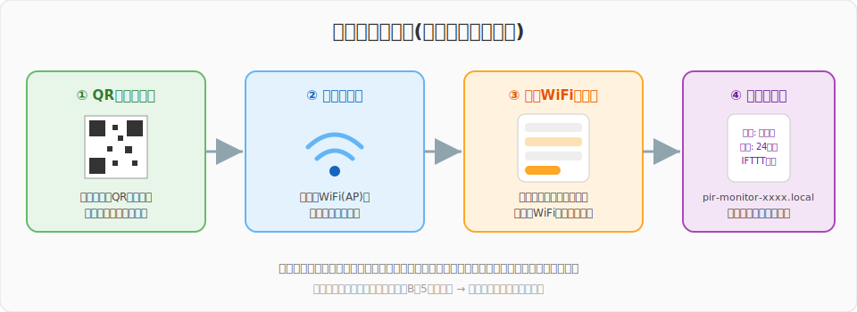

# PIR_AliveMonitoring — 独り暮らし向け「死活監視システム」

[](LICENSE)
[](https://docs.m5stack.com/en/core/m5stickc_plus)
[](https://www.arduino.cc/en/software)
[](https://protopedia.net/prototype/2432)

**M5StickC Plus + 人感センサ(PIR)で作る、独り暮らしのための見守りデバイスです。**

トイレなど「生活していれば必ず使う場所」にセンサを置き、**一定時間(初期設定では24時間)動きが検出されなかったらスマホへ通知**を送ります。コロナ禍の自粛生活で「孤独死」が頭をよぎった作者が、自分自身を見守るために作りました。

**v2.0.0から、面倒な設定はすべてスマホで完結。** 書き込んだら本体のQRコードを読み取るだけで、WiFi接続・場所の名前・通知時間・IFTTTキーをブラウザから設定できます。ソースコードの編集は一切不要です。


[](https://www.youtube.com/watch?v=CHICFVoL_tc)

> 📖 プロジェクトの詳細・開発ストーリーは [ProtoPedia の作品ページ](https://protopedia.net/prototype/2432) をご覧ください。

---

## 目次

- [仕組み](#仕組み)
- [必要なもの](#必要なもの)
- [セットアップ手順](#セットアップ手順)
  - [1. Arduino IDE の準備](#1-arduino-ide-の準備)
  - [2. ライブラリのインストール](#2-ライブラリのインストール)
  - [3. M5StickC Plus への書き込み](#3-m5stickc-plus-への書き込み)
  - [4. 初期設定(WiFi接続)](#4-初期設定wifi接続)
  - [5. IFTTT の設定](#5-ifttt-の設定)
- [使い方](#使い方)
- [設定ページでできること](#設定ページでできること)
- [カスタマイズ](#カスタマイズ)
- [トラブルシューティング](#トラブルシューティング)
- [v1.x からのアップデート](#v1x-からのアップデート)
- [ライセンス](#ライセンス)

---

## 仕組み

M5StickC Plus に取り付けた PIR センサ(人感センサ)が動きを監視し、Wi-Fi 経由で [IFTTT](https://ifttt.com/)(無料の Web サービス連携ツール)にイベントを送信、IFTTT がスマホへ通知を届けます。


通知は2種類あります。


| 通知 | タイミング | 意味 |
|---|---|---|
| ⚠ **未検出通知** | 24時間(設定値)動きが無かったとき | 「もしかして倒れている…?」の警告。以降24時間ごとに繰り返し通知 |
| ✓ **生存確認通知** | 未検出通知のあと、再び動きを検出したとき | 「無事でした!」の安心通知 |

> [!TIP]
> 通知先を家族や友人のスマホ(メールや Discord の共有チャンネルなど)にしておくと、万一のときに気づいてもらえます。

## 必要なもの

| 品名 | 説明 | 参考 |
|---|---|---|
| [M5StickC Plus](https://docs.m5stack.com/en/core/m5stickc_plus) | ESP32搭載の小型マイコン(画面・Wi-Fi内蔵) | M5Stack公式 / スイッチサイエンス等で購入可 |
| [PIR Hat (U054)](https://docs.m5stack.com/en/hat/hat-pir) | M5StickC用の人感センサHat。本体上部に挿すだけ | 同上 |
| USB Type-C ケーブル | プログラム書き込みと給電用 | データ通信対応のもの |
| 2.4GHz帯の Wi-Fi 環境 | 通知送信用 | ※ESP32は5GHz帯に接続できません |
| スマホ + [IFTTT](https://ifttt.com/) アカウント | 通知の受信用 | 無料プランでOK |

> [!NOTE]
> **配線・ハンダ付けは不要です。** PIR Hat を M5StickC Plus 上部の HAT 用ソケット(8ピン)に挿し込むだけで完成します。
>
> 後継機の **M5StickC Plus2** では使用ライブラリが異なるため、そのままでは動作しません(要改修)。

## セットアップ手順

### 1. Arduino IDE の準備

1. [Arduino IDE](https://www.arduino.cc/en/software)(2.x推奨)をインストールします。
2. `ファイル` → `基本設定` を開き、「追加のボードマネージャのURL」に以下を追加します。

   ```
   https://static-cdn.m5stack.com/resource/arduino/package_m5stack_index.json
   ```

3. `ツール` → `ボード` → `ボードマネージャ` で **「M5Stack」** を検索してインストールします。
4. `ツール` → `ボード` → `M5Stack` から **「M5StickCPlus」** を選択します。

### 2. ライブラリのインストール

`ツール` → `ライブラリを管理` から以下の2つを検索してインストールします。

| ライブラリ名 | 作者 | 用途 | 動作確認バージョン |
|---|---|---|---|
| **M5StickCPlus** | M5Stack | 本体制御 | 0.1.1 |
| **efont Unicode Font Data** | tanakamasayuki | 画面への日本語表示 | 1.0.9 |

> [!NOTE]
> M5Stackボードパッケージ **3.3.7** + 上記ライブラリの組み合わせでコンパイルできることを確認済みです(2026年7月時点)。

### 3. M5StickC Plus への書き込み

**ソースコードの編集は不要です。** そのまま書き込めます。

1. このリポジトリをダウンロード(`Code` → `Download ZIP`)または `git clone` します。
2. Arduino IDE で `PIR_AliveMonitoring.ino` を開きます。
3. M5StickC Plus を USB ケーブルで PC に接続し、`ツール` → `ポート` で該当の COM ポート(Macでは `/dev/cu.*`)を選択します。
4. 書き込みボタン(→)をクリックします。
5. 書き込みが完了すると、本体の画面に **QRコード付きの初期設定画面** が表示されます。

### 4. 初期設定(WiFi接続)

ここからはスマホだけで完結します。



1. 本体画面の **QRコードをスマホのカメラで読み取り**ます(本体のWiFiアクセスポイントに接続されます)。
   - QRが読めない場合は、画面に表示されているSSID(`PIR-Monitor-xxxx`)にパスワード `12345678` で手動接続してください。
2. 接続すると**設定ページが自動で開きます**(開かない場合はブラウザで `192.168.4.1` を開いてください)。
3. リストから**自宅のWi-Fi**を選び、パスワードを入力します。
4. 画面の案内に従って**本体URL(`http://pir-monitor-xxxx.local`)をコピー**してから「🛜 接続設定を保存」を押します。本体が再起動して自宅のWi-Fiに接続します。
5. スマホを自宅のWi-Fiに接続し直し、コピーした本体URLをブラウザで開くと、通知の設定ページが表示されます。

> [!TIP]
> 本体URLは **本体のボタンA(正面の `M5` ボタン)を短押し**するといつでもQRコードで表示できます。

### 5. IFTTT の設定

通知の送り先を IFTTT で設定します。**アプレット(自動化レシピ)を2つ**作成します。無料プランで作成できる数はアプレット2個までなので、ちょうど収まります。

> [!IMPORTANT]
> かつて定番だった **LINE Notify は2025年3月でサービス終了**しました。通知先には IFTTT公式アプリのプッシュ通知(Notifications)、メール(Email)、Discord などを利用してください。

#### 5-1. アカウント作成と Webhooks キーの取得

1. [IFTTT](https://ifttt.com/) でアカウントを作成します(スマホに [IFTTTアプリ](https://ifttt.com/products) も入れておくとプッシュ通知が受け取れて便利です)。
2. [Webhooks のページ](https://ifttt.com/maker_webhooks) を開き、`Documentation` をクリックします。
3. 表示される `Your key is: XXXXXXXX` の **キーをメモ**します。

#### 5-2. アプレット①「未検出通知」の作成

1. IFTTT で `Create` をクリックします。
2. **If This** → `Webhooks` → `Receive a web request` を選び、Event Name に半角で以下を入力します。

   ```
   AliveMonitoring
   ```

3. **Then That** → `Notifications` → `Send a notification from the IFTTT app` を選びます(通知先はメールやDiscordにも変更できます → [手順5-4](#5-4-通知先の設定例メールdiscordなど))。
4. Message に通知文を設定します。`Value1` には場所の名前、`Value2` には経過時間が入ります。

   ```
   ⚠ {{Value1}}が{{Value2}}使用されていません。安否を確認してください。
   ```

5. `Create action` → `Continue` → `Finish` で完成です。

#### 5-3. アプレット②「生存確認通知」の作成

同じ手順でもう1つ作成します。Event Name は以下にします。

```
DetectEvent
```

Message の例:

```
✅ {{Value1}}で動きを検出しました(未検出だった時間: {{Value2}})
```

#### 5-4. 通知先の設定例(メール・Discordなど)

手順5-2/5-3の **Then That** を変えるだけで、通知先は自由に選べます。本体から送られる材料(Ingredient)は共通で、Message欄に `Add ingredient` ボタンから挿入できます。

| Ingredient | 内容 |
|---|---|
| `Value1` | 場所の名前(設定ページで入力したもの) |
| `Value2` | 経過時間(例:「1日と2時間」。再起動後に検知記録が無い場合は「不明(再起動後はじめての検知)」) |
| `OccurredAt` | イベントの発生日時(IFTTTが自動で付与) |

<details>
<summary>📱 <b>IFTTTアプリのプッシュ通知(Notifications)</b> — いちばん手軽</summary>

手順5-2/5-3に書いたとおりです。スマホに [IFTTTアプリ](https://ifttt.com/products) を入れておくと、プッシュ通知で受け取れます。

</details>

<details>
<summary>✉️ <b>メール(Email)</b> — アプリ不要でどこでも届く</summary>

**Then That** → `Email` → `Send me an email` を選びます。

- アプレット①(AliveMonitoring)の例:
  - Subject: `【見守り通知】{{Value1}}で動きがありません`
  - Body: `⚠ {{Value1}}が{{Value2}}使用されていません。安否を確認してください。({{OccurredAt}})`
- アプレット②(DetectEvent)の例:
  - Subject: `【見守り通知】{{Value1}}で動きを検出`
  - Body: `✅ {{Value1}}で動きを検出しました(未検出だった時間: {{Value2}})`

届くのはIFTTTアカウントのメールアドレス宛です。家族に届けたい場合は、そのアドレスからの自動転送を設定するのが簡単です。

</details>

<details>
<summary>💬 <b>Discord(チャンネルに投稿)</b> — 家族・友人と共有するのに最適</summary>

家族や友人と共有しているサーバーのチャンネルに投稿すれば、全員が状況を見られます。

1. **Then That** → `Discord` → `Post a message to a channel` を選びます(初回はDiscordとの連携を求められるので、対象サーバーへの権限を許可します)。
2. `Which Channel?` で投稿先のサーバーとチャンネルを選びます。
3. Message に通知文を設定します。設定例(作者が実際に使っているもの):

   アプレット①(AliveMonitoring):

   ```
   【見守り通知】
   最後に {{Value1}} のセンサーが動きを検知してから {{Value2}} が経過しました。
   {{OccurredAt}}
   ```

   アプレット②(DetectEvent):

   ```
   【見守り通知】
   {{Value1}} のセンサーが動きを検知しました。
   ※前回の検知: {{Value2}} 前
   {{OccurredAt}}
   ```

4. `@everyone` などのメンションで気づきやすくしたい場合は、`Allowable mentions` を `All mentions allowed` にして、Message に `@everyone` を含めます。
5. `Update action`(新規作成時は `Create action`)で保存します。

> サーバーが選択肢に出てこない場合は、フォーム下の `reconnect the Discord service` から連携をやり直してください。

</details>

<details>
<summary>💚 <b>LINEに通知したい場合</b> — 直接連携は終了しています</summary>

LINE Notify と IFTTTのLINE連携は**2025年3月で終了**したため、現在IFTTTからLINEへ直接通知する方法はありません。LINEでの受け取りにこだわる場合は以下のような代替案があります。

- **メール通知にして、LINEのメール転送や通知連携アプリで受け取る**
- **家族にDiscordを入れてもらい、共有サーバーで受け取る**(操作感はLINEに近く、無料です)
- 上級者向け: LINE Messaging API で自作Botを立てる(IFTTTを介さず本体から直接送る改造が必要)

</details>

#### 5-5. 本体にキーを設定してテスト

1. 本体の設定ページ(`http://pir-monitor-xxxx.local`)を開きます。
2. 「🔔 IFTTT設定」に手順5-1でメモした**キーを入力**して保存します。
3. **「📨 テスト通知を送信」を押して、設定した通知先(IFTTTアプリ・メール・Discordなど)に届けば設定完了です!** 🎉

## 使い方


| 操作 | 動作 |
|---|---|
| **ボタンA を短押し** | 設定ページのQRコード/URLを表示(もう一度押すか60秒で戻る) |
| **ボタンA を長押し** | 1秒以上押し続けるとピッと音が鳴り、見守りの開始・停止が切り替わります(離すのを待たずに切り替わります) |
| **ボタンB を5秒長押し** | WiFi設定をリセットして初期設定モードに戻す |

- **「検出」表示はトイレの電気のように、最後の動きから60秒間続きます。** 本体の赤色LEDはセンサの生の反応にリアルタイムで連動するので、設置場所の反応確認に使えます。
- 旅行や帰省で長期間家を空けるときは、見守りを停止(ボタンA長押し、または設定ページから)しておくと誤通知を防げます。

**設置のコツ**: トイレ・廊下・洗面所など「生活していれば1日1回は必ず動きが発生する場所」に置いてください。PIR センサの検出範囲は最大約5m・水平約100°です。USB 電源に繋ぎっぱなしでの常時運用を想定しています。

## 設定ページでできること

スマホと本体が同じWi-Fiにあれば、ブラウザで `http://pir-monitor-xxxx.local`(ボタンA短押しでQR表示)を開くだけで、いつでも設定を変更できます。

| 設定 | 説明 |
|---|---|
| 見守りの開始/停止 | ボタン操作の代わりにブラウザから切り替え |
| 📍 場所の名前 | 通知に含まれる場所の名前(日本語OK。初期値: トイレ) |
| ⏰ 通知までの時間 | 1〜72時間から選択(初期値: 24時間) |
| 🔔 IFTTTキー | Webhooksのキー(本体内に保存され、外部には送信されません) |
| イベント名(詳細設定) | IFTTTのイベント名を変更した場合のみ |
| 📨 テスト通知 | その場で通知を送って設定を確認 |
| 🔄 WiFi設定リセット | 引っ越しやWi-Fi変更時に初期設定からやり直す |

ステータス表示では「最終検出が何分前か」も確認できます。

## カスタマイズ

日常の設定はすべて設定ページから変えられます。さらに細かい動作を変えたい場合は [config.h](config.h) の定数を編集してください。

| 定数 | 初期値 | 説明 |
|---|---|---|
| `DETECT_HOLD_SEC` | `60` | 「検出」表示を保持する秒数 |
| `LONG_PRESS_MS` | `800` | ボタンA長押しの判定時間(ミリ秒) |
| `INFO_SCREEN_TIMEOUT_MS` | `60000` | QR画面から自動で戻るまでの時間 |
| `AP_PASS` | `12345678` | 初期設定モードのAPパスワード |
| `DEFAULT_LIMIT_HOURS` など | - | 各設定の初期値 |

## トラブルシューティング

| 症状 | 確認すること |
|---|---|
| 初期設定のQRを読んでも設定ページが開かない | ブラウザで `192.168.4.1` を直接開く。スマホの「モバイルデータ通信を優先」設定が邪魔をする場合はOFFに |
| `pir-monitor-xxxx.local` が開けない | 同じWi-Fiに接続しているか確認。開けない場合はボタンA短押しのQR画面に表示される**IPアドレス**を直接開く(Androidの一部はmDNS非対応) |
| WiFi接続に失敗して初期設定モードに戻ってしまう | パスワードが正しいか。**2.4GHz帯**のSSIDか(5GHz帯は接続不可) |
| 通知が届かない | 設定ページの**テスト通知**で確認。IFTTTの `Activity` ページにログが出ているか。イベント名がIFTTT側と一致しているか |
| 時刻が `---- ---- ----` のまま | Wi-Fiがインターネットに接続できているか(NTPで時刻取得しています) |
| ずっと「検出」のまま | PIRセンサは温度変化に敏感です。直射日光やエアコンの風が当たらない場所へ。なお表示は仕様として最後の動きから60秒間保持されます |
| コンパイルエラー `efont.h: No such file...` | ライブラリ「efont Unicode Font Data」がインストールされているか |

## v1.x からのアップデート

v1.x(`config.h` にWiFi情報を書き込む方式)から v2.0.0 に書き込み直した場合、設定方式が変わったため**初期設定モードから再設定**してください。手順は[セットアップ手順4](#4-初期設定wifi接続)以降と同じです。

## ライセンス

[MIT License](LICENSE)

## 作者

**坪倉 輝明 (Teruaki Tsubokura)**

- ProtoPedia: https://protopedia.net/prototype/2432
- Web: https://teruaki-tsubokura.com/

センサやアイデアを変えれば「ペットの見守り」「実家の親の見守り」などにも応用できます。ぜひ自由に改造してください!
